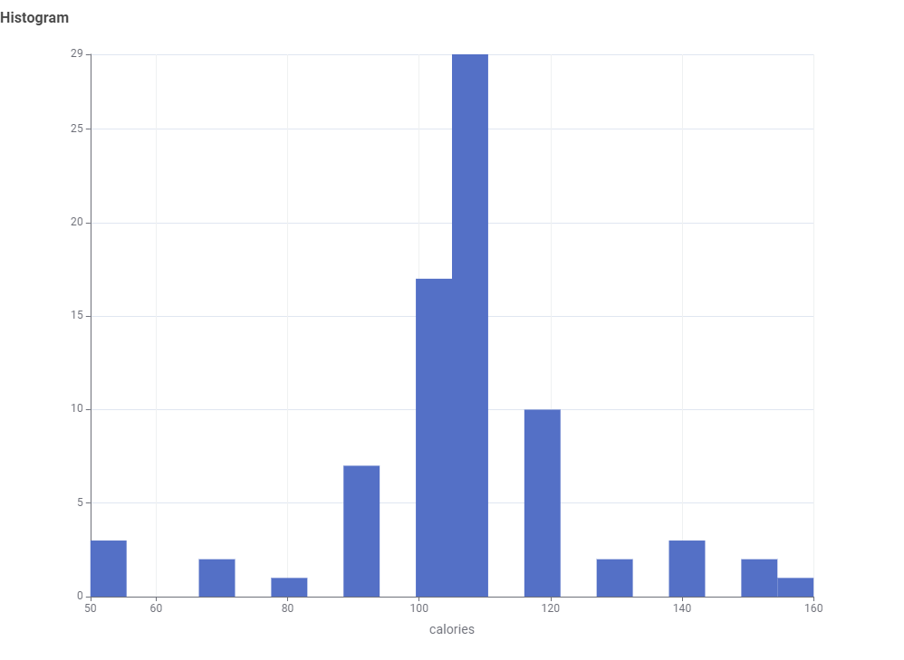

# 🥣 Analisis Dataset Cereals — KNIME Workflow

Repository ini berisi hasil analisis nutrisi produk sereal menggunakan KNIME, mulai dari proses membaca data mentah (*Cereals.csv*), pembersihan data, eksplorasi, hingga visualisasi dan insight akhir. Analisis berfokus pada hubungan nutrisi dengan rating setiap sereal.

---

# 📥 1. Proses Analisis: Dari CSV → KNIME → Visualisasi

Berikut adalah alur lengkap proses analisis:

---

## 🔹 **1. Import Data (Cereals.csv)**
Menggunakan node **CSV Reader**, KNIME membaca data mentah berisi:

- Kalori  
- Protein  
- Lemak  
- Natrium  
- Serat  
- Gula  
- Potassium  
- Rating  
- dan atribut lainnya

---

## 🔹 **2. Data Preprocessing**
Tahap pembersihan menggunakan KNIME:

- **Missing Value** → menangani nilai kosong  
- **Column Filter** → memilih kolom yang relevan  
- **Row Filter** → membuang baris yang tidak lengkap  
- Transformasi data dengan **Rule Engine** / **Math Formula** jika dibutuhkan  

Tujuannya membuat data siap dianalisis tanpa error.

---

## 🔹 **3. Exploratory Data Analysis (EDA)**
Menggunakan node:

- **Statistics**  
- **Data Explorer**  
- **Sorter / GroupBy**  

Memberikan gambaran awal, persebaran data, dan potensi pola.

---

# 📊 2. Visualisasi dan Penjelasan

Berikut visualisasi utama berdasarkan file PNG yang telah di-upload ke repository ini:

---

## 📈 **1. Distribusi Kalori (Histogram)**

Histogram menunjukkan bahwa sebagian besar produk sereal memiliki **90–120 kalori**.  
Ini menandakan produsen cenderung menjaga nilai kalori tetap moderat agar sereal dianggap lebih sehat sebagai menu sarapan.

---

## 📈 **2. Pengaruh Serat (Fiber) terhadap Rating**

Scatter plot menunjukkan hubungan kandungan **serat** dengan **rating**.  
Terlihat kecenderungan bahwa sereal dengan serat lebih tinggi sering mendapatkan rating lebih baik.  
Serat adalah komponen penting kesehatan sehingga memengaruhi persepsi kualitas.

---

## 📈 **3. Pengaruh Gula terhadap Rating**

Terlihat pola negatif: semakin tinggi kadar gula, rating cenderung menurun.  
Konsumen cenderung memilih sereal yang tidak terlalu manis dan lebih sehat.

---

## 📈 **4. Scatter Plot Nutrisi Lainnya**

Scatter Plot ini memberikan gambaran hubungan nutrisi lain terhadap rating.  
Variasi pola membantu memahami faktor tambahan yang berpengaruh terhadap kualitas sereal.

---

# 🧠 3. Insight & Kesimpulan

Berikut kesimpulan dari analisis KNIME dan visualisasi:

### ✔ **1. Kalori moderat adalah rentang umum produk**
Mayoritas sereal tidak terlalu tinggi kalori, mendukung citra makanan sehat.

### ✔ **2. Gula memengaruhi rating secara negatif**
Semakin manis produk, semakin rendah ratingnya.  
Konsumen lebih memilih sereal rendah gula.

### ✔ **3. Serat dan nutrisi baik lainnya meningkatkan rating**
Sereal dengan kandungan nutrisi seimbang dan tinggi serat lebih disukai.

### ✔ **4. Komposisi ideal berdasarkan dataset:**
- Gula rendah  
- Serat dan protein cukup tinggi  
- Kalori moderat  

### 🎯 **Kesimpulan Utama:**  
Sereal yang memiliki nutrisi sehat seperti **serat & protein tinggi** serta **gula rendah** mendapatkan rating yang lebih tinggi.  
KNIME sangat membantu dalam mengautomasi proses eksplorasi dan visualisasi dataset ini.

---

# 📂 4. Struktur Repository yang Direkomendasikan

